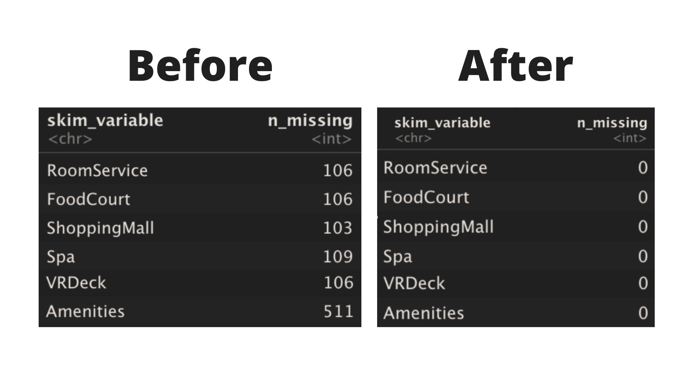
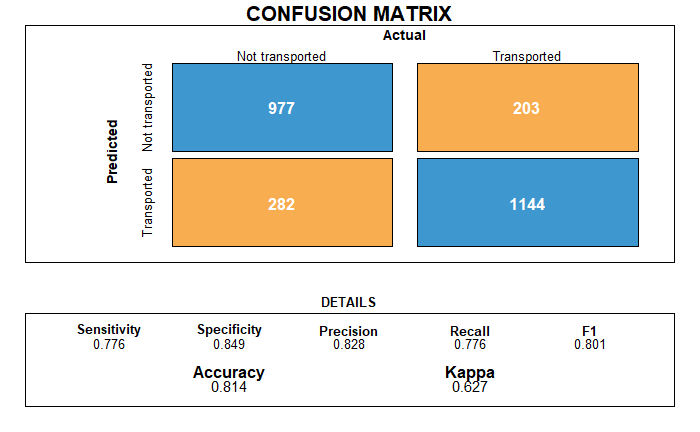

```{r packages,echo=FALSE,results=FALSE}

# Document setup in case packages or libraries are missing on the local galactic
# machine.

# In case there is a problem with rlang, remove and install the package again.
# remove.packages("rlang")
# install.packages("rlang")
# install.packages("tidyverse")
# install.packages("kableExtra")
# install.packages("skimr")
# install.packages("tidymodels")
# install.packages("ggstatsplot")
# install.packages("varImp")
# install.packages("randomForest")
# install.packages("ggpubr")
# install.packages("gginnards")
# install.packages("RANN")
# install.packages("jpeg")
# install.packages('moments')
# automate the download of a kaggle dataset in an R markdown,
# following this medium article: 
# https://medium.com/mcd-unison/how-to-use-kaggle-api-to-download-datasets-in-r-312179c7a99c
# install.packages(c("devtools"))
# devtools::install_github("ldurazo/kaggler")
```

```{r libraries, message=FALSE, warning=FALSE, include=FALSE,  echo=FALSE, results=FALSE}
suppressPackageStartupMessages(library("tidyverse"))
suppressPackageStartupMessages(library("kableExtra"))
suppressPackageStartupMessages(library("skimr"))
suppressPackageStartupMessages(library("tidymodels"))
suppressPackageStartupMessages(library("ggstatsplot"))
suppressPackageStartupMessages(library("randomForest"))
suppressPackageStartupMessages(library("varImp"))
suppressPackageStartupMessages(library("caret"))
suppressPackageStartupMessages(library("broom"))
suppressPackageStartupMessages(library("ggpubr"))
suppressPackageStartupMessages(library("gginnards"))
suppressPackageStartupMessages(library("modelr"))
suppressPackageStartupMessages(library("RANN"))
suppressPackageStartupMessages(library("readr"))
suppressPackageStartupMessages(library("kaggler"))
suppressPackageStartupMessages(library("moments"))

# the authentication file to download the data set from kaggle should be in 
# the root directory, otherwise the path should be modified accordingly.
# We created a general purpose access point for public consumption the key will
# be deleted at an appropriate time after the data has been presented.
kgl_auth(creds_file = 'kaggle.json')
```

# Introduction

The data source for this project comes from the automatic FTL
transmission sent by the spaceship titanic, during it's collision with a
temporal anomaly, in an as of yet to be determined galaxy.

The signal was intercepted by the universal receiving locating (URL)
ship mercury-redstone 320 at the following frequency:
<https://www.kaggle.com/competitions/spaceship-titanic/data>.

The message was intercepted on the 23rd of Feburary, 2022, galactic
standard age.

## Dataset description

Below the description of the contents of the intercepted message:

```{r data description, echo=FALSE}
code_book <- tribble(
  
  ~Variable, ~Description,
  
"PassengerId", "A unique Id for each passenger. Each Id takes the form gggg_pp where gggg indicates a group the passenger is travelling with and pp is their number within the group. People in a group are often family members, but not always.",

"HomePlanet", "The planet the passenger departed from, typically their planet of permanent residence.",

"CryoSleep", "Indicates whether the passenger elected to be put into suspended animation for the duration of the voyage. Passengers in cryosleep are confined to their cabins.",

"Cabin", "The cabin number where the passenger is staying. Takes the form deck/num/side, where side can be either P for Port or S for Starboard.",

"Destination", "The planet the passenger will be debarking to.",

"Age", "The age of the passenger",

"VIP", "Whether the passenger has paid for special VIP service during the voyage.",

"RoomService", "Amount the passenger has billed for room service.",

"FoodCourt", "Amount the passenger has billed for food.",

"ShoppingMall", "Amount the passenger has billed at the shopping mall.",

"Spa", "Amount the passenger has billed at the spa.",

"VRDeck", "Amount the passenger has billed at the vr deck.",

"Name", "The first and last names of the passenger",

"Transported", "Whether the passenger was transported to another dimension during the space time anomaly",)

kable(code_book)
```

## Purpose of the analysis

Mandated by the galactic space police central intelligence bureau, the
data science junior team comprised by Davide Gamba, Nathan Margni and
Christian Pala, was tasked to process the data collected from the
spaceship titanic in order to:

1.  Determine the time and place of the collision.

2.  Recover, as far as possible, the data corrupted by the transmission.

-   In case of unrecoverable data, reconstruct what it's most likely
    content was.

3.  Reconstruct the accident, in particular determine which areas of the
    ship suffered from a heavier impact with the temporal anomaly.

4.  Most importantly, determine the current whereabouts of the
    passengers present on the ship's manifesto, but not accounted for in
    the transmission, a total of 4277 registered galactic citizens.

## Conclusions summary:

1.  A first glimpse in the data transmitted showed it was impossible to
    locate the time and place of the collision, the galactic systems on
    the ship's projected route have been placed in high alert and tasked
    to report in case of positive identification of the spaceship
    Titanic.

2.  We managed to logically reconstruct a good amount of missing values
    by making reasonable assumptions about the laws governing the ship:
    We tested many different strategies to impute the missing amenities
    values, it was especially challenging due to the prevalence of
    non-spenders skewing the distributions, and we finally selected the
    knn-imputation's non-parametric solution.
    Finally we imputed missing ages with the median value of the known
    dataset, after checking it's distribution is positively skewed, and used the
    mode for categorical variables.
    
```{r conclusions missing values detective work, echo = FALSE}


```

```{r download collision image, echo=False}
download.file("https://storage.googleapis.com/kaggle-media/competitions/Spaceship%20Titanic/joel-filipe-QwoNAhbmLLo-unsplash.jpg",'collision.jpg', mode = 'wb', quiet = TRUE)
```
Collision reconstruction: 
```{r collision reconstruction, echo=False}
knitr::include_graphics("collision.jpg")
```

Data source: kaggle.com
  
3.  One important part of the project was to reconstruct the collision,
  The ship was hit hardest on decks B and C. Passengers in cryosleep, from
  Europa and / or travelling to 55 Cancri e were more likely transported
  to an other dimension, the same can be said, to a lesser degree, for
  passengers boarding on the starship's side of their cabin, and thus more
  exposed to space, as we expected.
  Passengers spending more time on the ship's amenities, which include
  many VIP's, were less likely transported, this surpised us and we assume
  most of the amenities are in areas of the ship which avoid most of the
  collision.
  Schematics of the ship have as of yet not been transmitted, a cross
  check is highly recommended to very our inferences, information on how
  we drew the conclusion above is provided in the specific chapter of this
  report.

4.  Since transported is a binary variable we decided to start with a
    logistic regression as the classifier and our baseline, we then
    expanded our modelling to a random forest. For both models we tried
    different pre-processing strategies, and feature selection, but in
    general the most intuitive model proved to be the better. We
    highlighted some interesting findings in the way the models prefer
    to feature select, compared to what we originally envisioned after
    our data exploration. The final results of the passengers we believe
    are most likely to be at risk are presented in the final chapter, we
    found a high likelihood that between 52 and 53 percent of the
    passengers whose status has not been transmitted by the FTL
    black-box, have been transported to another dimension by the
    temporal anomaly. Below we present the confusion matrix of our best
    random forest classifier:

```{r best classifier preview, echo = FALSE}

```

# Data cleaning and exploration:

## Import datasets:

The data from the FTL transmission was automatically transmitted to the
data science team.

```{r automatically import dataset, echo=FALSE,results=FALSE}


train_raw <- 
  kgl_competitions_data_download('spaceship-titanic', 'train.csv')

test_raw <- 
  kgl_competitions_data_download('spaceship-titanic', 'test.csv')

```

We left the manual import, in case there are problems with the
unofficial fork or the authentication, this requires the files to be
locally stored in the data directory of the project, on the local
government storage device.

```{r import train manually,echo=FALSE,results=FALSE}
# This chunk code should not be needed.
train_raw <- 
    read_csv(file.path("data","train.csv"))

test_raw <-
    read_csv(file.path("data","test.csv"))
```

## First look at the data

```{r initial EDA}
# strange bug in R that does not properly show the hist plots, solved with this
# workaround found on stackoverflow: https://stackoverflow.com/questions/44253848/skimr-cant-seem-to-produce-the-histograms
Sys.setlocale(locale='Chinese')
skim(train_raw)
skim(test_raw)
```

### Data storage issues

We noticed the following issues with the transmission format:

-   PassengerId is in the form gggg_pp, this is not in galactic tibble
    format, information on the group could also be useful, so we
    separated them and stored both.
-   Cabin is in the form deck/num/side, this is not in galactic tibble
    format, information on each category could also be useful, so we
    separated them and stored both.
-   Name is in the form first_name last_name, this is not in galactic
    tibble format, information on surnames in particular could be
    useful, so we separated them and stored both.
-   For modelling purposes we prefer 0's and 1's for binary categorical
    variables.
-   We would like to explore the cumulative use of all amenities on the
    ship, we created a new feature aggregating them.
-   We have a decent amount of missing values, due to FTL transmission
    corruption, we will dedicate a later chapter to our data
    reconstruction attempts.

```{r data storage}

train <- train_raw %>%
    separate(PassengerId, into=c('GroupId','IndividualId'), 
             sep="_", remove = FALSE) %>%
    separate(Cabin, into=c('Deck', 'RoomNumber', 'Side'), sep="/") %>%
    separate(Name, into=c('FirstName','LastName'),sep=" ") %>%   
    mutate(Transported = ifelse(Transported, 1, 0),
           CryoSleep = ifelse(CryoSleep, 1, 0), 
           VIP = ifelse(VIP, 1, 0),
           Side = ifelse(Side == 'S', 1, 0)) %>%
    mutate(Amenities = RoomService + FoodCourt + ShoppingMall + Spa + VRDeck) %>%
    dplyr::select(PassengerId, GroupId,IndividualId,HomePlanet,
           CryoSleep,Deck,RoomNumber,Side,Destination,Age,VIP,RoomService,
           FoodCourt,ShoppingMall,Spa,VRDeck,Amenities,
           FirstName,LastName, Transported)

test <- test_raw %>%
    separate(PassengerId, into=c('GroupId','IndividualId'), sep="_", remove = FALSE) %>%
    separate(Cabin, into=c('Deck', 'RoomNumber', 'Side'), sep="/") %>%
    separate(Name, into=c('FirstName','LastName'),sep=" ") %>%   
    mutate(CryoSleep = ifelse(CryoSleep, 1, 0), 
           VIP = ifelse(VIP, 1, 0),
           Side = ifelse(Side == 'S', 1, 0)) %>%
    mutate(Amenities = RoomService + FoodCourt + ShoppingMall + Spa + VRDeck) %>%
    dplyr::select(PassengerId, GroupId,IndividualId,HomePlanet,CryoSleep,
                  Deck,RoomNumber,Side,Destination,Age,VIP,RoomService,
                  FoodCourt,ShoppingMall,Spa,VRDeck,Amenities,
           FirstName,LastName)

train$GroupId <-as.integer(train$GroupId)
train$IndividualId <-as.integer(train$IndividualId)
test$GroupId <-as.integer(test$GroupId)
test$IndividualId <-as.integer(test$IndividualId)

skim(train)
skim(test)
print(train$Side[0:5])

```

## Missing values

This data-set is particularly interesting from the point of view of the
missing values. We will show there are ways to reconstruct what the
values likely are in some cases, without resorting to statistical
imputation,

### Amenities missing values

One way to reconstruct missing values is to check if people who chose to
go into cryosleep have missing values for the money spent on amenities,
in this case they should clearly be set to 0.

```{r missing amenities due to cryosleep}
count(filter(train,((CryoSleep == 1) &
             ((is.na(RoomService)) |
             (is.na(FoodCourt)) |
             (is.na(ShoppingMall)) |
             (is.na(Spa)) |
             (is.na(VRDeck))))))
```

As seen from the code above, there are many cases where we can perform
such an imputation.

```{r cryosleep amenities inputation}
train <-  train %>% 
          mutate(RoomService = ifelse(CryoSleep == 1 & !is.na(CryoSleep) , 0 , 
                                      RoomService),
                 FoodCourt = ifelse(CryoSleep == 1 & !is.na(CryoSleep) , 0 , 
                                    FoodCourt),
                 ShoppingMall = ifelse(CryoSleep == 1 & !is.na(CryoSleep) , 0 , 
                                       ShoppingMall),
                 Spa = ifelse(CryoSleep == 1 & !is.na(CryoSleep) , 0 , Spa),
                 VRDeck = ifelse(CryoSleep == 1 & !is.na(CryoSleep), 0, VRDeck))

test <-  test %>% 
          mutate(RoomService = ifelse(CryoSleep == 1 & !is.na(CryoSleep) , 0 , 
                                      RoomService),
                 FoodCourt = ifelse(CryoSleep == 1 & !is.na(CryoSleep) , 0 , 
                                    FoodCourt),
                 ShoppingMall = ifelse(CryoSleep == 1 & !is.na(CryoSleep) , 0 , 
                                       ShoppingMall),
                 Spa = ifelse(CryoSleep == 1 & !is.na(CryoSleep) , 0 , Spa),
                 VRDeck = ifelse(CryoSleep == 1 & !is.na(CryoSleep), 0, VRDeck))

```

We noticed some passengers are too young to use amenities, if there are
missing values for their amenities, they should be 0 instead. We counted
the number of instances.

```{r missing services due to age}
count(filter(train,((Age < 14) &
             ((is.na(RoomService)) |
             (is.na(FoodCourt)) |
             (is.na(ShoppingMall)) |
             (is.na(Spa)) |
             (is.na(VRDeck)) |
             (is.na(VIP))))))

```

And we imputed:

```{r age amenities inputation}

before_na_amenities_train <- train %>%
  dplyr::select(RoomService,FoodCourt,ShoppingMall,Spa,VRDeck) %>%
  summarise_all(list(~sum(is.na(.))))

before_na_amenities_test <- test %>%
  dplyr::select(RoomService,FoodCourt,ShoppingMall,Spa,VRDeck) %>%
  summarise_all(list(~sum(is.na(.))))

train <-  train %>% 
          mutate(RoomService = ifelse(Age < 14 & !is.na(Age) , 0 , RoomService),
                 FoodCourt = ifelse(Age < 14 & !is.na(Age) , 0 , FoodCourt),
                 ShoppingMall = ifelse(Age < 14 & !is.na(Age) , 0 , ShoppingMall),
                 Spa = ifelse(Age < 14 & !is.na(Age) , 0 , Spa),
                 VRDeck = ifelse(Age < 14 & !is.na(Age), 0, VRDeck))

test <-  test %>% 
          mutate(RoomService = ifelse(Age < 14 & !is.na(Age) , 0 , RoomService),
                 FoodCourt = ifelse(Age < 14 & !is.na(Age) , 0 , FoodCourt),
                 ShoppingMall = ifelse(Age < 14 & !is.na(Age) , 0 , ShoppingMall),
                 Spa = ifelse(Age < 14 & !is.na(Age) , 0 , Spa),
                 VRDeck = ifelse(Age < 14 & !is.na(Age), 0, VRDeck))

after_na_amenities_train <- train %>%
  dplyr::select(RoomService,FoodCourt,ShoppingMall,Spa,VRDeck) %>%
  summarise_all(list(~sum(is.na(.))))

after_na_amenities_test <- test %>%
  dplyr::select(RoomService,FoodCourt,ShoppingMall,Spa,VRDeck) %>%
  summarise_all(list(~sum(is.na(.))))
```

### Missing home planets and destinations.

Another assumption we can make, is that people with the same LastName
are travelling from the same planet to the same destination, does this
bear out?

```{r missing home planets}
train %>%
    group_by(LastName) %>%
    summarize(HomePlanets = n_distinct(HomePlanet),
              Destinations = n_distinct(Destination)) %>%
    arrange(desc(HomePlanets), desc(Destinations)) %>%
    drop_na()
```

We can see it's a decent assumption for home planet, where it would be a
correct assumption in most cases and a 50:50 in the remaining \~ 8% of
cases. It does not generally hold for destinations however, so we will
not use this method to impute destination missing values.

```{r impute home planets}
train_withna <- train %>% filter(is.na(LastName))
train_withoutna <- train %>% filter(!is.na(LastName))
  
try_train <- train_withoutna %>%
       dplyr::select(LastName,HomePlanet)

d_train <- na.omit(try_train)

try_train <- 
  transform(try_train, HomePlanet = d_train$HomePlanet[match(LastName,
                                                             d_train$LastName)])

train_withoutna$HomePlanet <- try_train$HomePlanet

train <- rbind(train_withna,train_withoutna)

test_withna <- test %>% filter(is.na(LastName))
test_withoutna <- test %>% filter(!is.na(LastName))
  
try_test <- test_withoutna %>%
       dplyr::select(LastName,HomePlanet)

d_test <- na.omit(try_test)

try_test <- 
  transform(try_test, HomePlanet = d_test$HomePlanet[match(LastName,
                                                           d_test$LastName)])

test_withoutna$HomePlanet <- try_test$HomePlanet

test <- rbind(test_withna,test_withoutna)

```

### Missing VIPs

Like the other amenities, VIP is very likely not available for young
passenger, we found no passenger younger than 18 registered as a VIP in
both datasets.

This is another imputation we can therefore quite safely make.

```{r missing VIPs age restriction}
train %>% dplyr::select(VIP,Age) %>% filter(!is.na(Age) & Age < 18 & !is.na(VIP)) %>%
summarize(Ages = n_distinct(Age),VIPs = n_distinct(VIP))

test %>% dplyr::select(VIP,Age) %>% filter(!is.na(Age) & Age < 18 & !is.na(VIP)) %>%
summarize(Ages = n_distinct(Age),VIPs = n_distinct(VIP), 
          VIP_Values = unique(VIP))
```

```{r minors are not VIPs}
train <- train %>%
          mutate(VIP = ifelse(Age < 18 & !is.na(Age), 0 , VIP))
test <- test %>%
          mutate(VIP = ifelse(Age < 18 & !is.na(Age), 0 , VIP))
```

## Other missing values

For the amenities missing values, we decided to create our own model to
predict what values should have been in those columns based on the other
information available.

For categorical variables we substituted with the mode, for the age we
imputed with the median, after noticing we could not produce a linear
model to impute, it was the most robust metric we have seen.

```{r standard imputations}

# recalculating total Amenities:
train$Amenities = train$RoomService + train$FoodCourt + 
  train$ShoppingMall + train$Spa + train$VRDeck

test$Amenities = test$RoomService + test$FoodCourt + 
  test$ShoppingMall + test$Spa + test$VRDeck

# Filling NA Age variables with the median, since age is positively skewed we
# chose the most robust measure.
train$Age[is.na(train$Age)] = median(train$Age, na.rm = TRUE)
test$Age[is.na(test$Age)] = median(test$Age, na.rm = TRUE)

# Filling NA categorical or binary variables with the mode
na_replace_Mode <- function(x) {
  ux <- unique(na.omit(x))
  x[is.na(x)] <- ux[which.max(tabulate(match(x, ux)))]
  x
}

train <- transform(train, HomePlanet = ave(HomePlanet, FUN = na_replace_Mode))
test <- transform(test, HomePlanet = ave(HomePlanet, FUN = na_replace_Mode))

train <- transform(train, Destination = ave(Destination, FUN = na_replace_Mode))
test <- transform(test, Destination = ave(Destination, FUN = na_replace_Mode))

train <- transform(train, VIP  = ave(VIP , FUN = na_replace_Mode))
test <- transform(test, VIP  = ave(VIP , FUN = na_replace_Mode))

train <- transform(train, CryoSleep  = ave(CryoSleep , FUN = na_replace_Mode))
test <- transform(test, CryoSleep  = ave(CryoSleep , FUN = na_replace_Mode))

train <- transform(train, Deck  = ave(Deck , FUN = na_replace_Mode))
test <- transform(test, Deck  = ave(Deck , FUN = na_replace_Mode))

train <- transform(train, Side  = ave(Side , FUN = na_replace_Mode))
test <- transform(test, Side  = ave(Side , FUN = na_replace_Mode))

#checking remaining missing values
sapply(train, function(x) sum(is.na(x)))

```

## Amenities models

We try to predict single amenities by using the features at our
disposal. We implemented two different strategies in order to achieve an
accurate reconstruction. Ultimately, the second strategy was the best
one.

### Strategy 1: Binary amenities imputation and linear reconstruction

Since most amenities have a value of 0, we thought we could encode the
amenities in binary features such that if a passenger has spent 0, the
new binary amenity will be set to 0, while if the passenger has spent
any amount of money in the amenity, it will be set to 1.

Once we have converted the amenities into a binary feature, we want to
train a random forest classifier to predict weather a certain missing
value for an amenity should be a 0 or a 1.

After having imputed the binary amenities, we want to reconstruct their
continuous values by training a linear regressor.

We thought that this strategy could work because it would have allowed
us, in theory, to easily predict the 0 values, and then just impute the
1s with a continuous value as to avoid to mess with the original
distribution which sees 0 being the most frequent value. We were pretty
sure that if we had tried to just impute the missing values with a
linear regressor, it would not have been able to parametrize properly.

#### Step 1: Transforming the amenities into binary features

```{r amenities model dataset}
train_bin_am <- train
train_bin_am$RoomService <- ifelse(train_bin_am$RoomService > 0.0, 1,ifelse(train_bin_am$RoomService == 0.0,0,NA))
train_bin_am$FoodCourt <- ifelse(train_bin_am$FoodCourt > 0.0, 1,ifelse(train_bin_am$FoodCourt == 0.0,0,NA))
train_bin_am$VRDeck <- ifelse(train_bin_am$VRDeck > 0.0, 1,ifelse(train_bin_am$VRDeck == 0.0,0,NA))
train_bin_am$ShoppingMall <- ifelse(train_bin_am$ShoppingMall > 0.0, 1,ifelse(train_bin_am$ShoppingMall == 0.0,0,NA))
train_bin_am$Spa <- ifelse(train_bin_am$Spa > 0.0, 1,ifelse(train_bin_am$Spa == 0.0,0,NA))
```

#### Step 2: Dropping all NA values before using amenities as targets.

```{r amenities dropping missing labels}
train_bin_am_na <- train_bin_am
train_bin_am <- train_bin_am %>% drop_na(RoomService, FoodCourt, VRDeck, ShoppingMall, Spa)
```

#### Step 3: Training the random forest classifiers.

While there is correlation between the various features (as in, if
someone has spent money for an amenity, it is likely that the same
person spent money for another amenity), we found hidden correlations
between having spent for an amenity, the home planet of the passenger
and the deck.

```{r modelling amenities with random forest}
amenities_predictor_train = subset(train_bin_am, select=-c(Transported, FirstName, LastName, Amenities, RoomNumber, GroupId, PassengerId, IndividualId, Side))

# check 
sapply(amenities_predictor_train, function(x) sum(is.na(x)))

set.seed(42)
rf_ShoppingMall <- randomForest(as.factor(ShoppingMall) ~ ., data = amenities_predictor_train, ntree = 400)
varImpPlot(rf_ShoppingMall, sort=TRUE )

rf_VRDeck <- randomForest(as.factor(VRDeck) ~ ., data = amenities_predictor_train, ntree = 400)
varImpPlot(rf_VRDeck, sort=TRUE )

rf_Spa <- randomForest(as.factor(Spa) ~ ., data = amenities_predictor_train, ntree = 400)
varImpPlot(rf_Spa, sort=TRUE )

rf_RoomService <- randomForest(as.factor(RoomService) ~ ., data = amenities_predictor_train, ntree = 400)
varImpPlot(rf_RoomService, sort=TRUE )

rf_FoodCourt <- randomForest(as.factor(FoodCourt) ~ ., data = amenities_predictor_train, ntree = 400)
varImpPlot(rf_FoodCourt, sort=TRUE)


rf_ShoppingMall
rf_VRDeck
rf_Spa
rf_RoomService
rf_FoodCourt
```

#### Plotting results.

We can see that the model does, in fact, predict the amenities with an
accuracy of around 80%. We can also note that the model is not just
predicting every amenity to be 0, by looking at the 1s accuracy rate (in
green) and the 0s accuracy rate (in red).

```{r amenities classification results}
plot(rf_FoodCourt)
plot(rf_RoomService)
plot(rf_ShoppingMall)
plot(rf_Spa)
plot(rf_VRDeck)
```

#### Step 4: Imputing with RandomForest

We predict whether a passenger has used or not a specific amenity

```{r predicting with random forest}
pred_roomService <- as.numeric(predict(rf_RoomService, subset(train_bin_am_na, select=-c(RoomService))))
pred_vrdeck <- as.numeric(predict(rf_VRDeck, subset(train_bin_am_na, select=-c(VRDeck))))
pred_spa <- as.numeric(predict(rf_Spa, subset(train_bin_am_na, select=-c(Spa))))
pred_shoppingMall <- as.numeric(predict(rf_ShoppingMall, subset(train_bin_am_na, select=-c(ShoppingMall))))
pred_foodCourt <- as.numeric(predict(rf_FoodCourt, subset(train_bin_am_na, select=-c(FoodCourt))))
```

Based on the prediction of the random forest models, we replace the NA
values in the dataset containing the binary values for the amenities
with the imputed results given by the models

```{r raplacing NA values with imputations}
library(dplyr)

imputed_bin_train <- train_bin_am_na

sapply(imputed_bin_train, function(x) sum(is.na(x)))


imputed_bin_train <- imputed_bin_train %>% mutate(RoomService = coalesce(RoomService, pred_roomService),
                       Spa = coalesce(Spa, pred_spa),
                       ShoppingMall = coalesce(ShoppingMall, pred_shoppingMall),
                       VRDeck = coalesce(VRDeck, pred_vrdeck),
                       FoodCourt = coalesce(FoodCourt, pred_foodCourt))

sapply(imputed_bin_train, function(x) sum(is.na(x)))
```

We drop the still remaining missing values

```{r drop remaining NA values}
imputed_bin_train <- train_bin_am %>% drop_na(RoomService, FoodCourt, VRDeck, ShoppingMall, Spa)
```

#### Step 5: Imputing 1s with Linear Regression

We try to predict the correct spending for each passenger

```{r training linear regression to impute the 1s}
library(MASS)
amenities_imp_train = subset(train, select=-c(PassengerId, Transported, FirstName, CryoSleep, LastName, Amenities, RoomNumber, GroupId, IndividualId))
amenities_imp_train <- filter(amenities_imp_train,  RoomService > 0 , FoodCourt > 0, ShoppingMall > 0, Spa > 0, VRDeck > 0, Age > 13 )

amenities_imp_train %>% mutate(across(where(is.numeric), scale))

room_imp = lm(RoomService~.,data= amenities_imp_train)
food_imp = lm(FoodCourt~.,data= amenities_imp_train)
shopping_mall_imp = lm(ShoppingMall~.,data= amenities_imp_train,)
spa_imp = lm(Spa~.,data= amenities_imp_train)
vr_imp = lm(VRDeck~.,data= amenities_imp_train)


head(amenities_imp_train)
```

```{r showing results of the predictions with linear regression}
summary(room_imp)
summary(food_imp)
summary(shopping_mall_imp)
summary(spa_imp)
summary(vr_imp)
```

We see that the explainability for the linear regression is very low,
with R\^2 values as low as 11%.

Just to try it out, we wanted to see if a poisson linear regression
would fit the data better.

```{r training the poisson linear regression model}
library(msme)

amenities_imp_train = subset(train, select=-c(PassengerId, Transported, FirstName, CryoSleep, LastName, Amenities, RoomNumber, GroupId, IndividualId))
amenities_imp_train <- filter(amenities_imp_train,  RoomService > 0 , FoodCourt > 0, ShoppingMall > 0, Spa > 0, VRDeck > 0, Age > 13 )

amenities_imp_train %>% mutate(across(where(is.numeric), scale))

room_imp = glm(RoomService~.,data= amenities_imp_train, family="poisson")
food_imp = glm(FoodCourt~.,data= amenities_imp_train, family="poisson")
shopping_mall_imp = glm(ShoppingMall~.,data= amenities_imp_train, family="poisson")
spa_imp = glm(Spa~.,data= amenities_imp_train, family="poisson")
vr_imp = glm(VRDeck~.,data= amenities_imp_train, family="poisson")

P__disp(room_imp)
P__disp(food_imp)
P__disp(shopping_mall_imp)
P__disp(spa_imp)
P__disp(vr_imp)
```

Even using a linear model with the poisson distribution doesn't yield
acceptable results. There is, in fact, a very high dispersion, which
means that the model didn't fit the data in an optimal way.

This is when we decided that we needed to discard this strategy.

### Strategy 2: Random Forest Regressor

We therefore decided to directly train a random forest regressor, in
order to see if the performances would be better than the binary values
approach.

```{r training the random forest regressor}

train_rf_reg <- train %>% drop_na(RoomService, FoodCourt, VRDeck, ShoppingMall, Spa)
amenities_predictor_train = subset(train_rf_reg, select=-c(Transported, FirstName, LastName, Amenities, RoomNumber, GroupId, IndividualId, Side))

# check 
sapply(amenities_predictor_train, function(x) sum(is.na(x)))

set.seed(42)
rf_ShoppingMall <- randomForest(ShoppingMall ~ ., data = amenities_predictor_train, ntree = 400)
varImpPlot(rf_ShoppingMall, sort=TRUE )

rf_VRDeck <- randomForest(VRDeck ~ ., data = amenities_predictor_train, ntree = 400)
varImpPlot(rf_VRDeck, sort=TRUE )

rf_Spa <- randomForest(Spa ~ ., data = amenities_predictor_train, ntree = 400)
varImpPlot(rf_Spa, sort=TRUE )

rf_RoomService <- randomForest(RoomService ~ ., data = amenities_predictor_train, ntree = 400)
varImpPlot(rf_RoomService, sort=TRUE )

rf_FoodCourt <- randomForest(FoodCourt ~ ., data = amenities_predictor_train, ntree = 400)
varImpPlot(rf_FoodCourt, sort=TRUE)


rf_ShoppingMall
rf_VRDeck
rf_Spa
rf_RoomService
rf_FoodCourt
```

During the presentation we gave internally about this report, we did not
notice an error which was making us use a random forest classifier
instead of a regressor, leading us to believe this strategy was roughly
equivalent to what we ended up selecting anyway, i.e. k-nearest-neighbor
imputation.

We noticed the inconsistency when checking what another galactic library
was achieving, much worse results, and confirmed it when trying to plot
a confusion matrix and realizing almost every point was considered as a
separate class.

### Strategy 3: Imputing with KNN

We can see that the Random Forest Regressor looks similar to the regular
linear regression. We are therefore going to try with a different
approach and train a KNN model to see if it able to fit the data any
better.

In the following sections, we are going to train a KNN model which will
predict the value of a single amenity.

We chose RoomService, since with the previous models, it was among the
ones that was returning consistent and average results.

```{r training KNN}

# We chose a dataset with no missing amenities
train_no_missing_amenities <- 
  filter(train,  !is.na(RoomService), !is.na(FoodCourt), !is.na(ShoppingMall), 
         !is.na(Spa), !is.na(VRDeck))


knn_trial <- train_no_missing_amenities
knn_trial <- knn_trial %>% mutate(value = 1)  %>% spread(HomePlanet, value,  fill = 0 )
knn_trial <- subset(knn_trial, select=-c(PassengerId, IndividualId, GroupId, Amenities, Deck, RoomNumber, Side, Destination, FirstName, LastName))


#A function to normalize the data
normalize <- function(x) {
return ((x - min(x)) / (max(x) - min(x))) }

# We normalize the data except for RoomService and we store the new values in the knn_trial.n variable
knn_trial.n <- as.data.frame(lapply(subset(knn_trial, select=-c(ShoppingMall)), normalize))


#We split into train and test
set.seed(42)

data.knn <- sample(1:nrow(knn_trial.n),size=nrow(knn_trial.n)*0.7,replace = FALSE) #random selection of 70% data.
 
knn.train <- knn_trial.n[data.knn ,] # 70% training data
knn.test <- knn_trial.n[-data.knn ,] # remaining 30% test data

knn.train_labels <- subset(knn_trial, select=c(ShoppingMall))[data.knn,1]
knn.test_labels <- subset(knn_trial, select=c(ShoppingMall))[-data.knn,1]

```

Now that the pre-processing is done, we move onto the creation of the
model.

First we need to choose a meaningful number of neighbors as a
hyper-parameter to our model.

In order to do so, it is good practice to choose the square root of the
number of data points at our disposal.

```{r calculating the number of data points}
library(class)
NROW(knn.train_labels)

```

The square root is around 75.6, so we can make two models, one with 75
neighbors and the other one with 76 and compare their performances.

```{r testing with different Ks}
knn.75 <- knn(train=knn.train, test=knn.test, cl=knn.train_labels, k=75)
knn.76 <- knn(train=knn.train, test=knn.test, cl=knn.train_labels, k=76)

```

```{r showing results of KNN}
ACC.75 <- 100 * sum(knn.test_labels == knn.75)/NROW(knn.test_labels)
ACC.76 <- 100 * sum(knn.test_labels == knn.76)/NROW(knn.test_labels)

ACC.75
ACC.76
```

The results seem to be much better than with any model tried before.
Because of this, we will keep the imputation obtained by KNN.

Here we take care of the actual imputation. Before doing that, we wanted
to check the distribution of the imputed variables.

```{r}
train_knn <- train
sapply(train_knn, function(x) sum(is.na(x)))


model <- preProcess(train_knn[,c('RoomService', 'FoodCourt', 'ShoppingMall', 'Spa', 'VRDeck', 'Deck')], method='knnImpute')
model_predict <- filter(train,  is.na(RoomService) | is.na(FoodCourt) | is.na(ShoppingMall) | is.na(Spa) | is.na(VRDeck))
model_predict <- predict(model, newdata = model_predict) 


procNames <- data.frame(col = names(model$mean), mean = model$mean, sd = model$std)

for(i in procNames$col){
  model_predict[i] <- model_predict[i]*model$std[i]+model$mean[i] 
}

model_predict
```

We verified that the new values imputed by KNN will follow similar
distributions to the ones with missing values presented in the next
section of the document, the two can be compared graphically.

```{r plotting distribution of imputed values}
ggplot(model_predict,mapping = aes(x=RoomService)) +
                 geom_histogram(bins = 50) +
                 labs(x = "Spending on Room Service",
                      y = "Number of Passengers",
                      title = "RoomService spending distribution (imputed by KNN)",
                      caption = "Data source: Kaggle.com")

ggplot(model_predict,mapping = aes(x=FoodCourt)) +
                 geom_histogram(bins = 50) +
                 labs(x = "Spending on Food Court",
                      y = "Number of Passengers",
                      title = "FoodCourt spending distribution (imputed by KNN)",
                      caption = "Data source: Kaggle.com")

ggplot(model_predict,mapping = aes(x=ShoppingMall)) +
                 geom_histogram(bins = 50) +
                 labs(x = "Spending on Shopping Mall",
                      y = "Number of Passengers",
                      title = "ShoppingMall spending distribution (imputed by KNN)",
                      caption = "Data source: Kaggle.com")

ggplot(model_predict,mapping = aes(x=Spa)) +
                 geom_histogram(bins = 50) +
                 labs(x = "Spending on Spa",
                      y = "Number of Passengers",
                      title = "Spa spending distribution (imputed by KNN)",
                      caption = "Data source: Kaggle.com")

ggplot(model_predict,mapping = aes(x=VRDeck)) +
                 geom_histogram(bins = 50) +
                 labs(x = "Spending on VR Deck",
                      y = "Number of Passengers",
                      title = "VRDeck spending distribution (imputed by KNN)",
                      caption = "Data source: Kaggle.com")
```

The distributions look fairly similar to the original ones.

We can now substitute into the original dataset the values imputed by
KNN. The function that we just used, with KNN impute, gives us back a
normalized version of our features. We want, however, to denormalize
them to be able to use them later for predicting Transported.

```{r substitute NA with KNN imputed amenities}

sapply(train, function(x) sum(is.na(x)))
#Imputing the missing values
imputed_knn <- predict(model, newdata = train) 

procNames <- data.frame(col = names(model$mean), mean = model$mean, sd = model$std)
for(i in procNames$col){
 train_knn[i] <- imputed_knn[i]*model$std[i]+model$mean[i] 
}

train_knn$RoomService <- as.numeric(format(train_knn$RoomService))

```

The last thing that we need to do is to calculate Amenities for the
newly imputed values.

```{r recalculating total amenities}
train_knn$Amenities = train_knn$RoomService + train_knn$FoodCourt + train_knn$ShoppingMall + train_knn$Spa + train_knn$VRDeck
```

And finally, use the newly imputed data as train

```{r using dataset with imputed amenities as train set}
train <- train_knn
```

# Exploratory data analysis (EDA):

Let's start looking at the numerical distributions in our data-set:

```{r numerical distributions}
ggplot(train) + 
      geom_histogram(mapping = aes(x=Age), bins=35) +
      labs(x = "Age (years)",
           y = "Number of Passengers",
           title = "Age distribution",
           caption = "Data source: Kaggle.com")
  
ggplot(train) + 
  geom_boxplot(mapping = aes(x=Transported, y=Age)) + 
  coord_flip() +
        labs(x = "Passengers",
           y = "Age",
           title = "Age distribution",
           caption = "Data source: Kaggle.com")

ggplot(train,mapping = aes(x=RoomService)) +
                 geom_histogram(bins = 50) +
                 labs(x = "Spending on Room Service",
                      y = "Number of Passengers",
                      title = "RoomService spending distribution",
                      caption = "Data source: Kaggle.com")

ggplot(train) + 
  geom_boxplot(mapping = aes(x=Transported, y=RoomService)) + 
  coord_flip() +
        labs(x = "Passengers",
           y = "Money spent on room service (in $)",
           title = "RoomService distribution",
           caption = "Data source: Kaggle.com")


ggplot(train,mapping = aes(x=FoodCourt)) +
                 geom_histogram(bins = 50) +
                 labs(x = "Spending on Food Court",
                      y = "Number of Passengers",
                      title = "FoodCourt spending distribution",
                      caption = "Data source: Kaggle.com")

ggplot(train) + 
  geom_boxplot(mapping = aes(x=Transported, y=FoodCourt)) + 
  coord_flip() +
        labs(x = "Passengers",
           y = "Money spent at the food court (in $)",
           title = "FoodCourt distribution",
           caption = "Data source: Kaggle.com")

ggplot(train,mapping = aes(x=ShoppingMall)) +
                 geom_histogram(bins = 50) +
                 labs(x = "Spending on Shopping Mall",
                      y = "Number of Passengers",
                      title = "Shopping mall spending distribution",
                      caption = "Data source: Kaggle.com")
ggplot(train) + 
  geom_boxplot(mapping = aes(x=Transported, y=ShoppingMall)) + 
  coord_flip() +
        labs(x = "Passengers",
           y = "Money spent at the shopping mall (in $)",
           title = "ShoppingMall distribution",
           caption = "Data source: Kaggle.com")


ggplot(train,mapping = aes(x=Spa)) +
                 geom_histogram(bins = 50) +
                 labs(x = "Spending on Spa",
                      y = "Number of Passengers",
                      title = "Spa spending distribution",
                      caption = "Data source: Kaggle.com")
ggplot(train) + 
  geom_boxplot(mapping = aes(x=Transported, y=Spa)) + 
  coord_flip() +
        labs(x = "Passengers",
           y = "Money spent at the spa (in $)",
           title = "Spa distribution",
           caption = "Data source: Kaggle.com")


ggplot(train,mapping = aes(x=VRDeck)) +
                 geom_histogram(bins = 50) +
                 labs(x = "Spending on VR Deck",
                      y = "Number of Passengers",
                      title = "VR Deck spending distribution",
                      caption = "Data source: Kaggle.com")
ggplot(train) + 
  geom_boxplot(mapping = aes(x=Transported, y=VRDeck)) + 
  coord_flip() +
        labs(x = "VRDeck",
           y = "Money spent at the vr deck (in $)",
           title = "VRDeck distribution",
           caption = "Data source: Kaggle.com")
                      
```

We have a lot of young passengers, the amenities are dominated by people
who did not spend anything.

We therefore decided to see how the log transform look like for
amenities to get a better big picture view of their distributions.

There are also some outliers, but on inspection we believe they
represent natural variations in the data, i.e. true outliers, so we are
not handling them.

```{r transformed amenities, warning=FALSE}

train_no_na <- drop_na(train)


simulatedGaussianA <- tibble(Age=rnorm(n = 1000,
                        mean=mean(train_no_na$Age),
                        sd = sd(train_no_na$Age)))

simulatedGaussianA %>%  
  ggplot()+ geom_density(aes(x=Age)) + labs(x = "Age (in years)",
                      y = "Count", title="Simulated Gaussian")+
      ggplot(train_no_na,mapping = aes(x=Age)) +
                   geom_density() +
                   labs(x = "Age (in years)",
                        y = "Count",
                        title = "Age distribution",
                        caption = "Data source: Kaggle.com")


train_no_na <- 
  filter(train_no_na,  RoomService> 0, FoodCourt > 0, ShoppingMall > 0, 
         Spa > 0, VRDeck > 0)

roomservice <- log10(train_no_na$RoomService)
simulatedGaussianR <- tibble(spending=rnorm(n = 1000,
                        mean=mean(roomservice),
                        sd = sd(roomservice)))

simulatedGaussianR %>%  
  ggplot()+ geom_density(aes(x=spending)) + labs(x = "Spending on room service",
                      y = "Passengers", title="Simulated Gaussian") +
  ggplot(train_no_na,mapping = aes(x=RoomService)) +
                 geom_density() +
                 labs(x = "Spending on room service",
                      y = "Passengers",
                      title = "Room service spending distribution",
                      caption = "Data source: Kaggle.com") +
                scale_x_log10()

ggplot(train_no_na) + 
  geom_boxplot(mapping = aes(x=Transported, y=log10(RoomService))) + 
  coord_flip() +
        labs(x = "Passengers",
           y = "Log of money spent on room service (in $)",
           title = "Log RoomService distribution",
           caption = "Data source: Kaggle.com")


foodcourt <- log10(train_no_na$FoodCourt)
simulatedGaussianF <- tibble(spending=rnorm(n = 1000,
                        mean=mean(foodcourt),
                        sd = sd(foodcourt)))

simulatedGaussianF %>%  
  ggplot()+ geom_density(aes(x=spending)) + labs(x = "Spending on food court",
                      y = "Passengers", title="Simulated Gaussian") +
  ggplot(train_no_na,mapping = aes(x=foodcourt)) +
                 geom_density() +
                 labs(x = "Spending on food court",
                      y = "Passengers",
                      title = "FoodCourt service spending distribution",
                      caption = "Data source: Kaggle.com") +
                scale_x_log10()

ggplot(train_no_na) + 
  geom_boxplot(mapping = aes(x=Transported, y=log10(FoodCourt))) + 
  coord_flip() +
        labs(x = "Passengers",
           y = "Log of money spent at the food court (in $)",
           title = "Log FoodCourt distribution",
           caption = "Data source: Kaggle.com")


shoppingmall <- log10(train_no_na$ShoppingMall)
simulatedGaussianS <- tibble(spending=rnorm(n = 1000,
                        mean=mean(shoppingmall),
                        sd = sd(shoppingmall)))

simulatedGaussianS %>%  
  ggplot()+ geom_density(aes(x=spending)) + labs(x = "Spending on shopping mall",
                      y = "Passengers", title="Simulated Gaussian") +
  ggplot(train_no_na,mapping = aes(x=shoppingmall)) +
                 geom_density() +
                 labs(x = "Spending on shopping mall",
                      y = "Passengers",
                      title = "ShoppingMall service spending distribution",
                      caption = "Data source: Kaggle.com") +
                scale_x_log10()

ggplot(train_no_na) + 
  geom_boxplot(mapping = aes(x=Transported, y=log10(ShoppingMall))) + 
  coord_flip() +
        labs(x = "Passengers",
           y = "Log of money spent at the shopping mall (in $)",
           title = "Log ShoppingMall distribution",
           caption = "Data source: Kaggle.com")


spa <- log10(train_no_na$Spa)
simulatedGaussianSp <- tibble(spending=rnorm(n = 1000,
                        mean=mean(spa),
                        sd = sd(spa)))

simulatedGaussianSp %>%  
  ggplot()+ geom_density(aes(x=spending)) + labs(x = "Spending on Spal",
                      y = "Passengers", title="Simulated Gaussian") +
  ggplot(train_no_na,mapping = aes(x=spa)) +
                 geom_density() +
                 labs(x = "Spending on spa",
                      y = "Passengers",
                      title = "Spa service spending distribution",
                      caption = "Data source: Kaggle.com") +
                scale_x_log10()

ggplot(train_no_na) + 
  geom_boxplot(mapping = aes(x=Transported, y=log10(Spa))) + 
  coord_flip() +
        labs(x = "Passengers",
           y = "Log of money spent at the Spa (in $)",
           title = "Log Spa distribution",
           caption = "Data source: Kaggle.com")


vr <- log10(train_no_na$VRDeck)
simulatedGaussianV <- tibble(spending=rnorm(n = 1000,
                        mean=mean(vr),
                        sd = sd(vr)))

simulatedGaussianSp %>%  
  ggplot()+ geom_density(aes(x=spending)) + labs(x = "Spending on VRDeck",
                      y = "Passengers", title="Simulated Gaussian") +
  ggplot(train_no_na,mapping = aes(x=vr)) +
                 geom_density() +
                 labs(x = "Spending on vr",
                      y = "Passengers",
                      title = "VRDeck service spending distribution",
                      caption = "Data source: Kaggle.com") +
                scale_x_log10()

ggplot(train_no_na) + 
  geom_boxplot(mapping = aes(x=Transported, y=log10(VRDeck))) + 
  coord_flip() +
        labs(x = "Passengers",
           y = "Log of money spent at the VRDeck (in $)",
           title = "Log VRDeck distribution",
           caption = "Data source: Kaggle.com")


# skeweness test for age.
print("We tested the skenewess of age, to validate our visual indicators of positive skeweness")
skewness(train_no_na$Age)
print("The test returns a value greater than 0, as expected.")

```

Applying a log transformation we get distributions that are a bit more
Gaussian in nature.

We will see if our models improve using log-transforms in the tuning
phase.

We also verified the positive skeweness of age, justifying our
imputation with the median instead of the mean value.

## Numerical correlations

```{r numerical correlations}
ggcorrmat(
  data = train, 
  cor.vars = c(Age,RoomService,FoodCourt,ShoppingMall,Spa,VRDeck),
  type = "spearman", 
  ggtheme = ggplot2::theme_dark()
)

ggcorrmat(
  data = train, 
  cor.vars = c(Age,RoomService,FoodCourt,ShoppingMall,Spa,VRDeck),
  type = "pearson", 
  ggtheme = ggplot2::theme_dark()
)

```

It seems from the spearman correlations, we have some non-linear
relationships between amenities, this may make non-linear classifiers
more effective for our data-sets, we will check these assumptions in the
modelling phase.

## Linear extrapolation of amenities.

One of our initial ideas to reconstruct the missing values for age was
to model it on the other variables with a linear regression. From the
numerical correlations it already seemed improbable we would be able to
do so.

We checked the scatter plot of age and the aggregated amenities to
confirm our intuition:

```{r scatter plot age, warning=FALSE}
ggplot(train, aes(Amenities, Age)) +
  geom_smooth(method='lm', formula= y~x)+
  geom_point() + 
  labs( x = " $ spent on amenities",
        y = "Age (in years)",
        title = "Amenities vs age scatter plot",
        caption = "Data source: Kaggle.com")
```

Given this plot it did not really make sense to try linear modelling on
the Age. As mentioned previously, we therefore decided to impute the
missing age values with the median, which should help with the long
tails we noticed in the distribution (as opposed to imputing with the
mean value).

To apply linear regression we decided to extrapolate how each amenity
contributes to the total, being sure there is a linear relationship in
this case, and that the coefficients should all be (close to) one.

```{r scatterplots amenities}

ggplot(train_no_missing_amenities, aes(RoomService, Amenities)) +
  geom_point() +
  geom_smooth(method='lm', formula= y~x)
  

ggplot(train_no_missing_amenities, aes(FoodCourt, Amenities)) +
  geom_smooth(method='lm', formula= y~x)+
  geom_point()

ggplot(train_no_missing_amenities, aes(ShoppingMall, Amenities)) +
  geom_smooth(method='lm', formula= y~x)+
  geom_point()

ggplot(train_no_missing_amenities, aes(Spa, Amenities)) + 
  geom_smooth(method='lm', formula= y~x)+
  geom_point()


ggplot(train_no_missing_amenities, aes(VRDeck, Amenities)) +
  geom_smooth(method='lm', formula= y~x)+
  geom_point()
```

```{r univariate linear models amenities}
room_reg = lm(Amenities~RoomService,data= train_no_missing_amenities)
food_reg = lm(Amenities~FoodCourt,data= train_no_missing_amenities)
shopping_mall_reg = lm(Amenities~ShoppingMall,data= train_no_missing_amenities)
spa_reg = lm(Amenities~Spa,data= train_no_missing_amenities)
vr_reg = lm(Amenities~VRDeck,data= train_no_missing_amenities)


summary(room_reg)
summary(food_reg)
summary(shopping_mall_reg)
summary(spa_reg)
summary(vr_reg)
```

Unsurprisingly none of the single variable models fit well, the most
interesting information we can extract from the models above is that
spending on room service and the shopping mall accounts for a very small
amount of the total spent on amenities.

```{r multivariate linear models amenities,  }
sanity_reg = lm(Amenities~RoomService + FoodCourt + ShoppingMall + 
                  Spa + VRDeck,data= train_no_missing_amenities)
summary(sanity_reg)
```

As expected the multivariate regression explains almost the total of
Amenities, with each coefficient equal to 1 (as it should be). Checking
the residuals:

```{r residual analysis}
train_withResid <- 
  as.data.frame(train_no_missing_amenities) %>% 
  add_residuals(sanity_reg) 

train_withResid %>% 
  ggplot()+ 
  geom_point(aes(
    x=seq_along(resid),
    y=resid))

```

We see no obvious pattern from the residuals and the mean is close to 0.

## Categorical variables:

Let's now check how the categorical variables are distributed amongst
their classes

```{r categorical variables distributions}
train %>% ggplot(aes(x=HomePlanet,fill=HomePlanet)) + 
                  geom_bar() +              
                  labs(title = "Home planet count distribution",
                  x = "Planet",
                  y = "Count",
                  caption = "Data source: kaggle:com")

train %>% ggplot(aes(x=Destination,fill=Destination)) + 
                  geom_bar() +              
                  labs(title = "Destination count distribution",
                  x = "Destination",
                  y = "Count",
                  caption = "Data source: kaggle:com")

train %>% ggplot(aes(x=Deck,fill=Deck)) + 
                  geom_bar() +              
                  labs(title = "Deck count distribution",
                  x = "Deck",
                  y = "Count",
                  caption = "Data source: kaggle:com")

train %>% mutate(CryoSleep = as.factor(CryoSleep)) %>% 
  mutate (CryoSleep = recode(CryoSleep, "0" = "False", "1" = "True"))  %>%
  ggplot(aes(x=CryoSleep,fill=CryoSleep))+ 
                  geom_bar() +              
                  labs(title = "Cryosleep selection count distribution",
                  x = "Cryosleep selected",
                  y = "Count",
                  caption = "Data source: kaggle:com")

train %>% mutate(VIP = as.factor(VIP)) %>%  
  mutate (VIP = recode(VIP, "0" = "False", "1" = "True")) %>%
  ggplot(aes(x=VIP,fill=VIP)) + 
                  geom_bar() +              
                  labs(title = "VIP's count distribution",
                  x = "VIP",
                  y = "Count",
                  caption = "Data source: kaggle:com")


train %>% mutate(Side = as.factor(Side)) %>% 
          mutate (Side = recode(Side, "0" = "Port", "1" = "Starboard")) %>% 
          ggplot(aes(x=Side, fill = Side)) + 
          geom_bar() +              
          labs(title = "Side's count distribution",
          x = "Side",
          y = "Count",
          caption = "Data source: kaggle.com")


```

-   Most passengers boarded from Earth, but we have enough data on all
    origin planets.
-   Most passengers are going to TRAPPIST-1e, but we have enough data on
    all destinations.
-   Most passengers are on decks F and G, interestingly almost none is
    on deck T, it's either a crew only area of the ship or dedicated to
    amenities.
-   Roughly two thirds of the passengers chose not go into cryosleep.
-   As expected we have very few VIP's on board.
-   The distribution between port and starboard accomodations is roughly
    balanced.

## Transported target.

In this section we will examine all of the dataset's features in
relation to our target, the transported status.

### Transported Target distribution, for known cases:

```{r target distribution}
 ggpiestats( data = train,
             x = Transported,
             label = "both",
             title = "Target distribution",
             legend.title = "Transported", 
             caption = "Data source: Kaggle.com",
             results.subtitle = FALSE,
             package = "ggsci",
             palette = "default_nejm",
             )
```

The target variable is well balanced, we can therefore work with
accuracy as our main metric, but we will also look at many other
measures.

### Transported and categorical variables:

Let's visualize the relationship between Transported and the categorical
variables

```{r target and categorical variables, warning = FALSE}
ggbarstats(train,
           x=Transported,
           y=HomePlanet,
           results.subtitle = FALSE,
           label = "both",
           title = "HomePlanet",
           legend.title = "Transported",
           caption = "Data source: Kaggle.com",
           package = "ggsci",
           palette = "default_nejm")

ggbarstats(train,
           x=Transported,
           y=Destination,
           results.subtitle = FALSE,
           label = "both",
           title = "Destination",
           legend.title = "Transported",
           caption = "Data source: Kaggle.com",
           package = "ggsci",
           palette = "default_nejm")

ggbarstats(train,
           x=Transported,
           y=CryoSleep,
           results.subtitle = FALSE,
           label = "both",
           title = "CryoSleep",
           legend.title = "Transported",
           caption = "Data source: Kaggle.com",
           package = "ggsci",
           palette = "default_nejm") 

ggbarstats(train,
           x=Transported,
           y=VIP,
           results.subtitle = FALSE,
           label = "both",
           title = "VIP",
           legend.title = "Transported",
           caption = "Data source: Kaggle.com",
           package = "ggsci",
           palette = "default_nejm")


ggbarstats(train,
           x=Transported,
           y=Deck,
           results.subtitle = FALSE,
           label = "both",
           title = "Deck",
           legend.title = "Transported",
           caption = "Data source: Kaggle.com",
           package = "ggsci",
           palette = "default_nejm")

ggbarstats(train,
           x=Transported,
           y=Side,
           results.subtitle = FALSE,
           label = "both",
           title = "Side",
           legend.title = "Transported",
           caption = "Data source: Kaggle.com",
           package = "ggsci",
           palette = "default_nejm")


ggbarstats(train,
           x=Transported,
           y=Side,
           results.subtitle = FALSE,
           label = "both",
           title = "Side",
           legend.title = "Transported",
           caption = "Data source: Kaggle.com",
           package = "ggsci",
           palette = "default_nejm")

train_graph <- train

train_graph <- train_graph %>% mutate(BinnedAmenities = 
                                        cut(Amenities, breaks=c(0, 1000, 50000)))

levels(train_graph$BinnedAmenities) <- c("less than 1000$", "more than 1000$")

train_graph <- train_graph %>% mutate(BinnedAges = 
                                        cut(Age, breaks=c(0, 20, 40, 90)))

lab <- format(date_breaks, "%d - %d")

vip = ggbarstats(train_graph,
           x=BinnedAmenities,
           y=VIP,
           results.subtitle = FALSE,
           label = "both",
           title = "VIPs and spending",
           legend.title = "Spent",
           caption = "Data source: Kaggle.com",
           package = "ggsci",
           palette = "default_nejm")

age = ggbarstats(train_graph,
           x=BinnedAmenities,
           y=BinnedAges,
           results.subtitle = FALSE,
           label = "both",
           title = "Age and spending",
           caption = "Data source: Kaggle.com",
           package = "ggsci",
           palette = "default_nejm")

delete_layers(vip, "GeomLabel")
delete_layers(age, "GeomLabel")

```

From the plots we noticed it seems more likely to be transported for
passengers from Europa, more likely to be transported for passengers
going to 55 Cancri, and for VIP's, also very likely to be transported if
you're in cryosleep, if your side is starboard, and if you are on decks
B or C.

Let's see if these intuitions are corroborate by Anova Tests:

#### Anova tests

```{r ANOVA tests}
# for all home planets
car::Anova(lm(Transported~HomePlanet,
              data=train))

# is Europa  the only reason for the mean being different?
train_test_home <- train %>% 
  filter(HomePlanet!='Europa')
car::Anova(lm(Transported~HomePlanet,
              data = train_test_home))

# for all destinations
car::Anova(lm(Transported~Destination,
              data=train))

# is 55 Cancri the only reason for the mean being different?
train_test_destination <- train %>% 
  filter(Destination!='55 Cancri e')
car::Anova(lm(Transported~Destination,
              data = train_test_destination))

# Interestingly, at alpha = 0.05 yes.


car::Anova(lm(Transported~CryoSleep,
              data=train))

car::Anova(lm(Transported~VIP,
              data=train))

car::Anova(lm(Transported~Deck,
              data=train))

car::Anova(lm(Transported~Side,
              data=train))

car::Anova(lm(Transported~BinnedAges,
              data=train_graph))

# is the difference only caused by young people being unable to spend much?
train_graph_anova <- train_graph %>% 
  filter(BinnedAges!= "(0,20]")
car::Anova(lm(Transported~BinnedAges,
              data = train_graph_anova))
# interestingly that seems to be mostly the case.
```

All tests corroborate our intuition, we therefore assume the anomaly hit
closer to decks B and C, which were more populated by people from
Europa, going to Cancri e and / or VIP, it's also very likely it hit the
area of the ship hosting at least some of the rooms dedicated to
cryosleep, finally as one would expect people closer to the external
area of the hull, hence starboard were more likely to be hit.

After consulting our supervisor, we also excluded the most obvious class
for HomePlanet and Destination, we found that the mean is strongly
significantly different for all home planets, but the same cannot be
said for destinations, in that case Cancri 55 e is really the most
important factor for the three destinations having different transported
means.

We also checked how passengers, their home planets and destinations,
were distributed on the ship:

```{r decks and home planets}
deck_plot_h <-ggbarstats(train,
            x=Deck,
            y=HomePlanet,
            results.subtitle = FALSE,
            label = "percentage",
            bf.message = FALSE,
            title = "Decks by HomePlanet",
            legend.title = "Deck",
            caption = "Data source: Kaggle.com",
            package = "ggsci",
            palette = "default_nejm")


deck_plot_d <-ggbarstats(train,
            x=Deck,
            y=Destination,
            results.subtitle = FALSE,
            label = "percentage",
            bf.message = FALSE,
            title = "Decks by Destination",
            legend.title = "Deck",
            caption = "Data source: Kaggle.com",
            package = "ggsci",
            palette = "default_nejm")


delete_layers(deck_plot_d, "GeomLabel")
delete_layers(deck_plot_h, "GeomLabel")
```

This reinforces our hypothesis, there are exclusively passengers from
Europa on decks B and C, most of the people travelling to 55 Cancri e
were also on those decks.

### Numerical variables and the target

```{r amenities density plots with transported}

train_amenities_no_na <- train

## age plot
age_plot <-  
  ggplot(train_amenities_no_na,mapping = 
           aes(x=Age,fill = as.factor(Transported))) +
  geom_histogram(bins = 40) +
  labs(title = "Age distribution",
       x = "Age (in years)",
       y = "Count",
       fill='Transported') + 
  scale_fill_manual(values = c("blue", "red"))

## Amenities plots
roomservice_plot <- 
  ggplot(train_amenities_no_na, 
         aes(x = RoomService, fill = as.factor(Transported))) +
  geom_histogram(bins = 12) +
  labs(title="RoomService distribution",
       x = "Spent (in $)",
       fill='Transported') + 
  scale_fill_manual(values = c("blue", "red"))


## Spa plot
spa_plot <- 
  ggplot(train_amenities_no_na, 
         aes(x = Spa, fill = as.factor(Transported))) +
  geom_histogram(bins = 12) + 
  labs(title="Spa distribution",
       x = "Spent (in $)",
       fill='Transported') + 
  scale_fill_manual(values = c("blue", "red"))


foodcourt_plot <- 
  ggplot(train_amenities_no_na, 
         aes(x = RoomService, fill = as.factor(Transported))) +
  geom_histogram(bins = 12) +
  labs(title="FoodCourt distribution",
       x = "Spent (in $)",
       fill='Transported') + 
  scale_fill_manual(values = c("blue", "red"))


shoppingmall_plot <- 
  ggplot(train_amenities_no_na, 
         aes(x = RoomService, fill = as.factor(Transported))) +
    geom_histogram(bins = 12)  + 
    labs(title="ShoppingMall distribution",
       x = "Spent (in $)",
       fill='Transported') + 
    scale_fill_manual(values = c("blue", "red"))


vrdeck_plot <- 
  ggplot(train_amenities_no_na, 
         aes(x = RoomService, fill= as.factor(Transported))) +
  geom_histogram(bins = 12)  +
  labs(title="VRDeck distribution",
       x = "Spent (in $)",
       fill='Transported') + 
  scale_fill_manual(values = c("blue", "red"))


figure <- ggarrange(age_plot, roomservice_plot, spa_plot, foodcourt_plot, 
          shoppingmall_plot, vrdeck_plot,
           ncol = 2, nrow = 3)

annotate_figure(figure,
               top = text_grob("Numerical Variables Histograms and Transported", 
                               face = "bold", size = 14),
               bottom = text_grob("Data source: kaggle.com", size = 10))
```

```{r amenities normalized}

# creating distributions plots

train_no_0 <- filter(train,  RoomService > 0 , FoodCourt > 0, ShoppingMall > 0, 
                     Spa > 0, VRDeck > 0 )

## age plot
age_plot <-  ggplot(train,mapping = aes(x=Age,fill = as.factor(Transported))) +
             geom_density(alpha=0.4) +
             labs(title = "Age distribution",
                  x = "Age (in years)",
                  y = "Count",
                  fill='Transported')+ 
              scale_fill_manual(values = c("blue", "red"))

## Amenities plots
## room service plot
roomservice_plot <- 
  ggplot(train_no_0, aes(x = RoomService, fill = as.factor(Transported))) +
  geom_density(alpha=0.4) + 
  scale_x_log10() +
  labs(title="RoomService distribution (log)",
       x = "Spent (in $)",
       fill='Transported')+ 
       scale_fill_manual(values = c("blue", "red"))


## Spa plot
spa_plot <- 
  ggplot(train_no_0, aes(x = Spa, fill = as.factor(Transported))) +
  geom_density(alpha=0.4) + 
  scale_x_log10() +
  labs(title="Spa distribution (log)",
       x = "Spent (in $)",
       fill='Transported') + 
       scale_fill_manual(values = c("blue", "red"))

foodcourt_plot <- 
  ggplot(train_no_0, aes(x = RoomService, fill = as.factor(Transported))) +
  geom_density(alpha=0.4) + 
  scale_x_log10() +
  labs(title="FoodCourt distribution (log)",
       x = "Spent (in $)",
       fill='Transported')+ 
       scale_fill_manual(values = c("blue", "red"))

shoppingmall_plot <- 
  ggplot(train_no_0, aes(x = RoomService, fill = as.factor(Transported))) +
  geom_density(alpha=0.4) + 
  scale_x_log10() +
  labs(title="ShoppingMall distribution (log)",
       x = "Spent (in $)",
       fill='Transported')+ 
       scale_fill_manual(values = c("blue", "red"))

vrdeck_plot <- 
  ggplot(train_no_0, aes(x = RoomService, fill= as.factor(Transported))) +
  geom_density(alpha=0.4) +
  scale_x_log10() +
  labs(title="VRDeck distribution (log)",
       x = "Spent (in $)",
       fill='Transported')+ 
       scale_fill_manual(values = c("blue", "red"))


 # plotting all plots
figure <- ggarrange(age_plot, roomservice_plot, spa_plot, foodcourt_plot, 
          shoppingmall_plot, vrdeck_plot,
           ncol = 2, nrow = 3)


annotate_figure(figure,
               top = text_grob("Numerical Variables density plots and Transported", 
                               face = "bold", size = 14),
               bottom = text_grob("Data source: kaggle.com", size = 10))

```

Especially for people spending a lot of money (and hence time) at the
amenities, and in particular at the spa, the chances of being
transported is lower.

Our hypothesis is these amenities are not in the area of the ship with
which the anomaly collided.

There seems to be little relation between age and being transported,
although people between 20 and 40 seem to be less likely to be
transported, from our age analysis to decide how to impute missing
values, we know there are more big spenders than average in this age
bracket, that could be a reason for this behavior.

# Modelling

In this chapter we will discuss our modelling on transported, the target
variable. Since transported is a binary variables, classification models
are appropriate. We decide to start with a baseline logistic regression,
to see how the most common model would perform, to then expand to random
forests. Given some non-linear relationships we found in the previous
analysis, we expect random forest to perform better.

## Modelling Transported

As usual we work on a separate dataset:

```{r transported dataset}
train_transported <- train 
test_transported <- test
```

Imputations for the Transported modelling, ensuring there are no missing
values in the features of interest, we also selected the features that
made the most sense to us, after our exploratory analysis.

```{r pre-processing for transported}
# counting NA values
sapply(train_transported, function(x) sum(is.na(x)))
sum(is.na(train_transported))


# Filling NA numeric variables with the mean, safety measure in case some missing
# values were left from the amenities imputation via KNN.

train_transported$RoomService[is.na(train_transported$RoomService)] <- 
  mean(train_transported$RoomService, na.rm = TRUE)

test_transported$RoomService[is.na(test_transported$RoomService)] <- 
  mean(test_transported$RoomService, na.rm = TRUE)

train_transported$FoodCourt[is.na(train_transported$FoodCourt)] <- 
  mean(train_transported$FoodCourt, na.rm = TRUE)

test_transported$FoodCourt[is.na(test_transported$FoodCourt)] <- 
  mean(test_transported$FoodCourt, na.rm = TRUE)

train_transported$ShoppingMall[is.na(train_transported$ShoppingMall)] <- 
  mean(train_transported$ShoppingMall, na.rm = TRUE)

test_transported$ShoppingMall[is.na(test_transported$ShoppingMall)] <- 
  mean(test_transported$ShoppingMall, na.rm = TRUE)

train_transported$Spa[is.na(train_transported$Spa)] <- 
  mean(train_transported$Spa, na.rm = TRUE)
test_transported$Spa[is.na(test_transported$Spa)] <- 
  mean(test_transported$Spa, na.rm = TRUE)

train_transported$VRDeck[is.na(train_transported$VRDeck)] <- 
  mean(train_transported$VRDeck, na.rm = TRUE)

test_transported$VRDeck[is.na(test_transported$VRDeck)] <- 
  mean(test_transported$VRDeck, na.rm = TRUE)


# removing irrelevant columns
train_transported <- 
  subset( train_transported, select = c(-FirstName,  -RoomNumber, -GroupId,
                                        - IndividualId, -LastName ,-Amenities,  
                                        -PassengerId))

test_transported <- 
  subset( test_transported, select = c(-FirstName,  -RoomNumber, -GroupId, 
                                       -IndividualId, -LastName,-Amenities, 
                                       -PassengerId))


#checking remaining missing values
sapply(train_transported, function(x) sum(is.na(x)))
sapply(test_transported, function(x) sum(is.na(x)))


```

## Training and validation datasets:

Train-test-split, since we only have the training set, we are using part
of it as a validation dataset.

```{r train_test_split transported}
sample <- sample(c(TRUE, FALSE), nrow(train_transported), 
                 replace=TRUE, prob=c(0.7,0.3))
train_data  <- train_transported[sample, ]
test_data   <- train_transported[!sample, ]
train.control <- trainControl(method = "cv", number = 10)
```

## Logistic regression

we proceed to train the logistic regression on our basic setup:

```{r logistic regression transported}
# training a logistic regression model with most important features
glm_fit <- glm(formula=Transported~., data= train_data, family="binomial")
summary(glm_fit)

# testing on the validation set 
testPred <- glm_fit %>% augment(new_data=test_data,type.predict = "response")
testPred <- testPred %>% mutate(binaryPred = as.numeric(.fitted>0.5))
testPred %>% summarise(accuracy=mean(binaryPred==Transported))
```

It's interesting to note VIP does not seem to be very relevant, after
discussing this with our team supervised, we believe most of the
explainability coming from VIP has already been covered by the
amenities, i.e. the feature is interesting only because of it's
relationship with how often VIP's use amenities and were therefore less
likely to be on the decks of the ship hit the hardest. The remaining
information contained in the feature seems to be of little relevance.

Note also that the sample start to become very small since the original
number of VIP's was small to begin with and we are already factoring in
the heavy spenders with the amenities, leaving very few data points.

We are also implementing a cross validation with 10 splits, to ensure we
get a robust result.

```{r logreg with cross validation, warning=FALSE}

fitControl <- trainControl(method="cv",number= 10, savePredictions = T)

model_cv <- train(as.factor(Transported) ~ ., data=train_transported, 
                  method="glm", family="binomial", trControl = fitControl)

model_cv

```

The results are very similar. We already obtain quite a good score with
our basic logistic regression.

## Tuning the logistic regression

We tried tuning it to see if using scaled features for amenities or
adding / removing some columns of interest would yield a better score:

The first step was to check the variable importance according to our
basic logistic regression model:

```{r logreg variable importance}
importance <- as.data.frame(caret::varImp(glm_fit, scale=TRUE))
importance <- data.frame(overall = importance$Overall,
           names   = rownames(importance))
importance[order(importance$overall,decreasing = T),]
```

We noticed Age and VIP are not that relevant and tried excluding them:

```{r second logreg model,  warning=FALSE}

train_transported_2 <- subset( train_transported, select = c(-Age,  -VIP))
test_transported_2 <- subset( test_transported, select = c(-Age, -VIP))


model_cv_2 <- train(as.factor(Transported) ~ ., data=train_transported_2, 
                    method="glm", family="binomial", trControl = fitControl)

model_cv_2


```

We get very similar, and in most runs slightly improved results. To us
this is an indicator that the logistic regression cannot capture all the
complexities in the dataset.

We also checked if our galactic library for linear models already takes
care of scaling, confirming that this is the case:

```{r scaled logistic model}
scalable = c("RoomService", "FoodCourt", "ShoppingMall", "Spa", "VRDeck")
train_transported_scaled <- train_transported %>% mutate_each(list(~log(1 + .)), 
                                                              scalable)

model_cv_3 <- train(as.factor(Transported) ~ ., data=train_transported_scaled, 
                    method="glm", family="binomial", trControl = fitControl)

model_cv_3
```

As foreshadowed our manual scaling is worse than letting the library
scale the values on it's own.

We also checked possible changes in variable importance:

```{r scaled logistic model variable importance}
glm_fit_scaled <- glm(formula=Transported~., data= train_transported_scaled, 
                      family="binomial")

importance <- as.data.frame(caret::varImp(glm_fit_scaled, scale=TRUE))
importance <- data.frame(overall = importance$Overall,
           names   = rownames(importance))
importance[order(importance$overall,decreasing = T),]

```

We don't observe major differences, in particular we were curious about
cryosleep, which to the eye-test seems the most relevant feature, but
scaling manually to be sure we are measuring values on similar scales
confirms that the logistic regression model finds many of the amenities
to be the most important features to determine the passenger's
transportation status.

## Random Forest

```{r confusion matrix prep, echo = FALSE}
draw_confusion_matrix <- function(cm) {

  layout(matrix(c(1,1,2)))
  par(mar=c(2,2,2,2))
  plot(c(100, 345), c(300, 450), type = "n", xlab="", ylab="", xaxt='n', 
       yaxt='n')
  title('CONFUSION MATRIX', cex.main=2)

  # create the matrix 
  rect(150, 430, 240, 370, col='#3F97D0')
  text(195, 435, 'Not transported', cex=1.2)
  rect(250, 430, 340, 370, col='#F7AD50')
  text(295, 435, 'Transported', cex=1.2)
  text(125, 370, 'Predicted', cex=1.3, srt=90, font=2)
  text(245, 450, 'Actual', cex=1.3, font=2)
  rect(150, 305, 240, 365, col='#F7AD50')
  rect(250, 305, 340, 365, col='#3F97D0')
  text(140, 400, 'Not transported', cex=1.2, srt=90)
  text(140, 335, 'Transported', cex=1.2, srt=90)

  # add in the cm results 
  res <- as.numeric(cm$table)
  text(195, 400, res[1], cex=1.6, font=2, col='white')
  text(195, 335, res[2], cex=1.6, font=2, col='white')
  text(295, 400, res[3], cex=1.6, font=2, col='white')
  text(295, 335, res[4], cex=1.6, font=2, col='white')

  # add in the specifics 
  plot(c(100, 0), c(100, 0), type = "n", xlab="", ylab="", 
       main = "DETAILS", xaxt='n', yaxt='n')
  text(10, 85, names(cm$byClass[1]), cex=1.2, font=2)
  text(10, 70, round(as.numeric(cm$byClass[1]), 3), cex=1.2)
  text(30, 85, names(cm$byClass[2]), cex=1.2, font=2)
  text(30, 70, round(as.numeric(cm$byClass[2]), 3), cex=1.2)
  text(50, 85, names(cm$byClass[5]), cex=1.2, font=2)
  text(50, 70, round(as.numeric(cm$byClass[5]), 3), cex=1.2)
  text(70, 85, names(cm$byClass[6]), cex=1.2, font=2)
  text(70, 70, round(as.numeric(cm$byClass[6]), 3), cex=1.2)
  text(90, 85, names(cm$byClass[7]), cex=1.2, font=2)
  text(90, 70, round(as.numeric(cm$byClass[7]), 3), cex=1.2)

  # add in the accuracy information 
  text(30, 35, names(cm$overall[1]), cex=1.5, font=2)
  text(30, 20, round(as.numeric(cm$overall[1]), 3), cex=1.4)
  text(70, 35, names(cm$overall[2]), cex=1.5, font=2)
  text(70, 20, round(as.numeric(cm$overall[2]), 3), cex=1.4)
}  
```

Our assumption is the random forest will perform better, we tried
selecting a few different values for the number of trees and the best
setup seems to be around 1000 trees, although similar accuracies are
already reached with 200 trees. The galactic data science team luckily
has enough computing power to optimize.

```{r random forest training}
set.seed(42)
rf <- randomForest(as.factor(Transported) ~ ., 
                   data = train_data,
                   ntree = 1000,
                   importance = T)

plot(rf)
varImpPlot(rf, sort=TRUE)
rf

```

The feature importance plot is very similar to what we obtain with the
logistic regression, reinforcing our conclusions on amenitites being
more important predictors compared to what one might think.

## Random forest results

Our results are summarized in this confusion matrix, most of the common
evaluation metrics are provided, and there is no big difference between
which one we may choose, as expected from a balanced dataset.

```{r random forest results}
# creating evaluation matrix 
prediction <-predict(rf, test_data, "response")
prediction <- factor(prediction,levels=c(0,1))

cm <- confusionMatrix(prediction, as.factor(test_data$Transported))

draw_confusion_matrix(cm)
```

Besides tuning the number of trees, we also performed some features
selection on the model, by keeping only the most important features, as
per the results of the logistic regression.

```{r}
rf_2.0 <- randomForest(as.factor(Transported) ~ CryoSleep + FoodCourt + Spa + Deck + VRDeck + RoomService + Age + HomePlanet,
                   data = train_data,
                   ntree = 1000,
                   importance = T)

plot(rf_2.0)
varImpPlot(rf_2.0, sort=TRUE)
rf_2.0

```

The confusion matrix for the new random forest is presented below:

```{r random forest second model results}
# creating evaluation matrix 
prediction <-predict(rf_2.0, test_data, "response")
prediction <- factor(prediction,levels=c(0,1))

cm <- confusionMatrix(prediction, as.factor(test_data$Transported))

draw_confusion_matrix(cm)
```

As expected for a more complex model, removing even marginal information
lowers the accuracy, so there is no need to do so.

# Results and conclusion:

Those are our predictions with regards to the passengers whose status is
currently unknown:

```{r test set predictions}

# predicting transported label on the test set
test_pred_log_reg <-predict(model_cv, test_transported)
test_pred_rf <- predict(rf, test_transported)

 # creating a df with the predictions
columns_names <- c("PassengerId", "Transported")
logreg_predictions_df <- data.frame(test$PassengerId, test_pred_log_reg)
rf_predictions_df <- data.frame(test$PassengerId, test_pred_rf)

colnames(logreg_predictions_df) <- columns_names
colnames(rf_predictions_df) <- columns_names

logreg_predictions_df$Transported <- logreg_predictions_df$Transported == 1
rf_predictions_df$Transported <- rf_predictions_df$Transported == 1
```

here presented in graphic form

```{r results visualizations}

# plotting transported predictions distributions 
# and showing datasets for both models
ggpiestats( data = logreg_predictions_df,
             x = Transported,
             label = "both",
             title = "Predicted label distribution with logistic regression and crossvalidation",
             legend.title = "Transported", 
             results.subtitle = FALSE,
             package = "ggsci",
             palette = "default_nejm",
             caption = "Data source: Kaggle.com",)

print(logreg_predictions_df)

ggpiestats( data = rf_predictions_df,
             x = Transported,
             label = "both",
             title = "Predicted label distribution with random forest",
             legend.title = "Transported", 
             results.subtitle = FALSE,
             package = "ggsci",
             palette = "default_nejm",
             caption = "Data source: Kaggle.com")

print(rf_predictions_df)

```

Summarizing we expect between 52% and 53% of the passengers whose status
is unknown to have been transported to an alternative dimension, perhaps
slightly higher than an initial analysis would have led us to believe.

We are quite confident the anomaly hit decks B and C, targeting
disproportionately passengers from Europa going to Cancri 55 e, people
in cryosleep and people who were bunked on the starboard side of the
ship.

Families, who's relatives on-board profile fits those categories, are
strongly encouraged to contact their closest galactic policy center with
the passenger's information.

# References

-   Spaceship Titanic \| Kaggle (2022, June 13).
    <https://www.kaggle.com/competitions/spaceship-titanic>
-   Azzimonti, D. (2022, June 13). Slides by professor Dario Azzimonti.
    iCorsi. <https://www.icorsi.ch/course/view.php?id=13860>
-   Papandrea, M. (2022, June 13). Slides by professor Michela
    Papandrea. iCorsi. <https://www.icorsi.ch/course/view.php?id=12716>
-   Durazo, L. (2022, June 13). How to use Kaggle API to download
    datasets in R. Medium.
    <https://medium.com/mcd-unison/how-to-use-kaggle-api-to-download-datasets-in-r-312179c7a99c>
